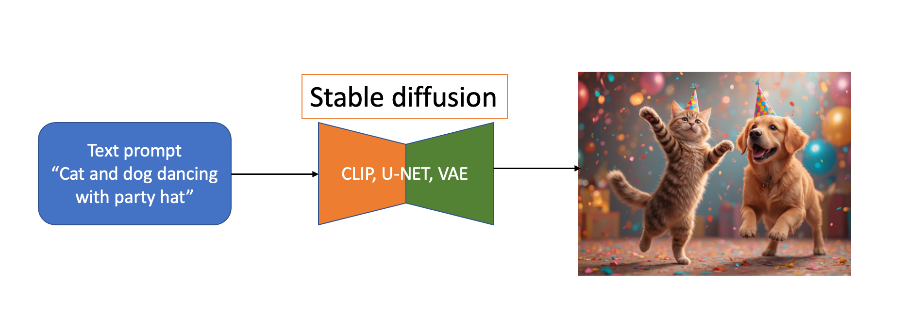
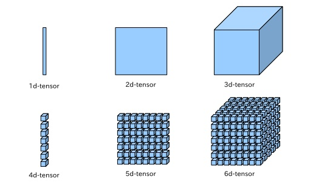
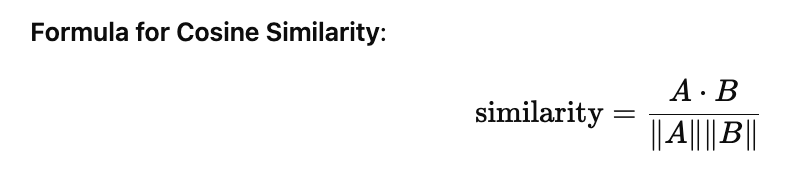
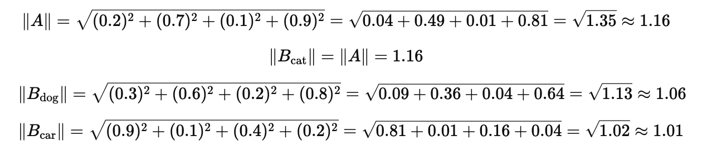
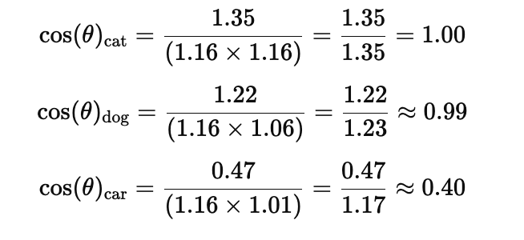
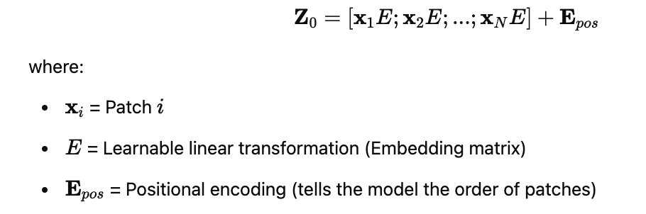
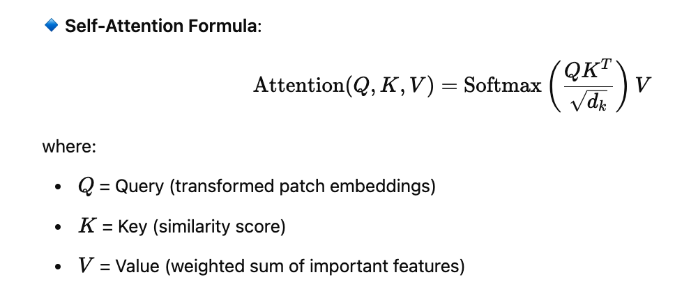

# Stable diffusion คืออะไร

**Picture 1.** Simple steps to generate image with stable diffusion  

 ถ้าอธิบายภาษาบ้าน ๆ ดูตามรูปเลย คือ เขียนข้อความ แล้วใช้โมเดล ของ Stable diffusion  หลัก ๆ สามตัวนี้ คือ CLIP, U-NET และ VAE
 จบ การอธิบาย แบบง่าย ๆ เข้าใจแค่นี้ เจนรูปได้แล้ว

---
 แต่ถ้าใครอยากเข้าใจมากขึ้น (ปวดหัวมากกว่านี้) ลองตามอ่านต่อ

อย่างที่บอก Stable diffusion มีองค์ประกอบหลัก ๆ  3 โมเดล 

1. CLIP - เป็นเหมือนตัวจับคู่ ภาพกับข้อความ โดยใช้เครื่องมือ ที่เรียกว่า การ Transformer (แปลงให้เป็นตัวเลข ในรูป Vecter, matric, Tensors, Flat number) ถ้าเป็นรูป เรียกว่า Vision Transformer (ViT) ถ้าเป็น ตัวอักษรเรียกว่า  Text transformer
  
**Picture 2.** Example vector to Tensors  

  
**Picture 3.** ตัวอย่าง เวคเตอร์ และ Tensor ในรูปตัวเลข  

3. U-NET - คือการ denoise รออ่านข้อ 5.2
4. VAE - ตัวเข้ารหัส เรียกเท่ ๆ ว่า Encode จาก Pixel (เช่น รูปภาพ 512 x 512 x 3 RGB color ) เป็น Latent (64 x 64 x 4 channels) และตัวถอดรหัส แปลง Latent มาเป็น Pixel เพื่อได้รูปภาพ - รออ่านข้อ 5.3

## 5.1 การทำงานของ CLIP
กระบวนการทำงานของ CLIP สมมุติได้รับข้อความ "แมว"   
**CLIP (Contrastive Language-Image Pretraining)** เป็นโมเดลที่พัฒนาโดย OpenAI ซึ่งสามารถจับคู่ข้อความ (Text) กับภาพ (Image) โดยใช้ Contrastive Learning เมื่อ CLIP ได้รับ ข้อความ เช่น "แมว", กระบวนการทำงานสามารถสรุปได้เป็น 4 ขั้นตอนหลัก: ดังนี้ 

1️⃣ Tokenization (แปลงข้อความเป็นตัวเลขที่โมเดลเข้าใจ)

🔹 ขั้นตอนแรก, ข้อความ "แมว" จะถูกส่งไปยัง Text Encoder  
🔹 CLIP ใช้ Byte-Pair Encoding (BPE) เพื่อแปลงคำเป็น Token IDs เช่น [[1, 1, 1, 1]] 

2️⃣ Text Encoding (แปลง Token เป็น Vector ฝังตัว - Embedding)  
หลังจาก Tokenization, CLIP จะใช้ Transformer-based Text Encoder เพื่อแปลงข้อความเป็นเวกเตอร์ (Text Embedding)

💡 กระบวนการทำงานใน Text Encoder

ใช้ Pre-trained Transformer Model เช่น ViT หรือ ResNet
แปลงข้อความ "แมว" เป็น Vector Embedding ขนาด 512 หรือ 768 มิติ
Self-Attention Mechanism ช่วยโมเดลทำความเข้าใจความหมายของคำในบริบท
 ### เช่น Output: torch.Size([1, 4, 768])

| โมเดล        | หน้าที่หลัก                       | ใช้ใน Stable Diffusion อย่างไร?  | Hugging Face Model | Research Paper |
|-------------|--------------------------------|--------------------------------|--------------------|----------------|
| **CLIP**    | Text-to-Image Matching        | แปลง Prompt เป็น Text Embedding | [openai/clip-vit-large-patch14](https://huggingface.co/openai/clip-vit-large-patch14) | [CLIP: Contrastive Language-Image Pretraining](https://arxiv.org/abs/2103.00020) |
| **T5**      | Text-to-Text Learning         | ใช้ใน Prompt Engineering | [t5-base](https://huggingface.co/t5-base) | [Exploring the Limits of Transfer Learning with a Unified Text-to-Text Transformer](https://arxiv.org/abs/1910.10683) |
| **BART**    | Denoising & Summarization     | ใช้ปรับปรุง Prompt อัตโนมัติ | [facebook/bart-large](https://huggingface.co/facebook/bart-large) | [BART: Denoising Sequence-to-Sequence Pre-training](https://arxiv.org/abs/1910.13461) |
| **ViT**     | Image Understanding           | ใช้ตรวจสอบภาพที่สร้างจาก SD | [google/vit-base-patch16-224](https://huggingface.co/google/vit-base-patch16-224) | [An Image is Worth 16x16 Words: Transformers for Image Recognition](https://arxiv.org/abs/2010.11929) |
| **LDM**     | Latent Diffusion Model        | โมเดลหลักของ Stable Diffusion | [CompVis/stable-diffusion-v1-4](https://huggingface.co/CompVis/stable-diffusion-v1-4) | [High-Resolution Image Synthesis with Latent Diffusion Models](https://arxiv.org/abs/2112.10752) |

ตัวอย่างงานวิจัยของ โมลเดลต่างการ เกี่ยวกับ CLIP etc.  

3️⃣ เปรียบเทียบกับ Image Embeddings (ถ้ามีภาพให้เปรียบเทียบ)  
หาก CLIP ได้รับภาพคู่กับข้อความ "แมว", ระบบจะทำงานดังนี้:  

🔹 Image Encoding (เปลี่ยนภาพเป็นเวกเตอร์)  

CLIP ใช้ Vision Transformer (ViT) หรือ ResNet  
แปลงภาพเป็น Image Embedding ขนาด 768 มิติ  
🔹 คำนวณความคล้ายคลึงกัน ***(Cosine Similarity)***

คำนวณ Cosine Similarity ระหว่าง Text Embedding และ Image Embedding  
หาก ค่าสูง แสดงว่า ข้อความกับภาพตรงกัน  

4️⃣ Output & Decision (ตัดสินใจผลลัพธ์)  
🔹 หาก Cosine Similarity สูง, โมเดลอาจ แสดงภาพที่เกี่ยวข้องกับข้อความ "แมว" 
🔹 หากไม่มีภาพเปรียบเทียบ, CLIP อาจใช้ embedding เพื่อ: 

ค้นหารูปที่ใกล้เคียงที่สุด ในฐานข้อมูล  
พยากรณ์ว่าข้อความอธิบายอะไร  

# 🖼️ Step-by-Step การคำนวณ Embedding Calculation  

## **1️⃣ แปลง รูป หรือ Text เป็น vector (4D)**
| **Input**   | **Vector Representation** |
|------------|--------------------------|
| 🐱 **รูป Cat**  | `[0.2, 0.7, 0.1, 0.9]` |
| **"ข้อความ cat"**  | `[0.2, 0.7, 0.1, 0.9]` |
| **"ข้อความ dog"**  | `[0.3, 0.6, 0.2, 0.8]` |
| **"ข้อความ car"**  | `[0.9, 0.1, 0.4, 0.2]` |

---

## 2️⃣ สูตรคำนวณ Cosine similarity

  
**Picture 4.** สมาการการคำนวณ Cosine Similarity เพื่อใช้ในการเช็คว่า ข้อความใกล้เคียงกับรูปภาพมากแค่ไหน  

where:
- ** A = Image Embedding**
- ** B = Text Embedding**
- ** A.B** = Dot Product
- ** ||A||,||B||** = Magnitudes (Vector Norms)

---

## **3️⃣ Compute Dot Product**

### **🔹 Dot Product รูปภาพแมว 🐱 และ "ข้อความ cat"**
\[(0.2 x 0.2) + (0.7 x 0.7) + (0.1 x 0.1) + (0.9 x 0.9)\]\[= 0.04 + 0.49 + 0.01 + 0.81 = 1.35\]

### **🔹 Dot Product รูปภาพแมว 🐱 และ "ข้อความ dog"**
\[(0.2 x 0.3) + (0.7 x 0.6) + (0.1 x 0.2) + (0.9 x 0.8)\]\[= 0.06 + 0.42 + 0.02 + 0.72 = 1.22\]

### **🔹 Dot Product รูปภาพแมว 🐱 และ "ข้อความ car"**
\[(0.2 x 0.9) + (0.7 x 0.1) + (0.1 x 0.4) + (0.9 x 0.2)\]\[= 0.18 + 0.07 + 0.04 + 0.18 = 0.47\]

หลังจากคำนวณ รูปภาพแมว และคำว่า แมว มีค่า 1.35 / รูปภาพแมว และคำว่า หมา มีค่า 1.22 / รูปภาพแมว และคำว่า รถยนต์ มีค่า 0.47 
เพราะฉนั้น มันจะจับคู่ คำว่าแมว เพื่อเอามาสร้างภาพแมวได้ จากค่าเหล่านี้
---

## **4️⃣ Compute Magnitudes (Vector Norms)**
Magnitude (Norm) ของเวกเตอร์ คือค่าที่ใช้บอก ขนาดของเวกเตอร์ หรือความยาวของเวกเตอร์ในมิติของมัน ซึ่งเป็นค่าที่ใช้ใน Cosine Similarity, Distance Calculation และ Normalization  
🔹 ใน Image & Text Embedding, เราคำนวณ Norm เพื่อ:  

วัดระยะห่างระหว่างเวกเตอร์สองตัว  
ใช้ในการคำนวณ Cosine Similarity เพื่อวัดความคล้ายคลึง  
ทำให้เวกเตอร์เป็นมาตรฐานเดียวกัน (Normalization)  
### **🔹 Magnitude รูปภาพแมว 🐱**  
อย่างเช่น เรามี vector ของรูปภาพ  
A=[0.2,0.7,0.1,0.9]  

**Picture 5.** วิธีการคำนวณ magnitude ของรูปภาพ  
ในการคำนวณ Cosine Similarity, เราต้องใช้ Magnitude เพื่อปรับสเกลของเวกเตอร์:  
ใช้ สัญลักษณ์ ||A||  
--- 

## **5️⃣ Compute Cosine Similarity**  

### **🔹 Cosine Similarity with "ข้อความ cat"**  

---

## **📊 6️⃣ Final Ranking Based on Cosine Similarity**  

| **Text Option** | **Cosine Similarity** | **Ranking** |
|---------------|------------------|-------------|
| **"A cat"** | **1.00** | ✅ **Best Match** |
| **"A dog"** | **0.99** | 🔹 **Second Best** |
| **"A car"** | **0.40** | ❌ **Least Similar** |

🎯 จะเห็นว่า **"A cat"** มีค่า similarity score สูงสุด (**1.00**), คำว่าแมวมีค่า Cosine ใกล้เคียงกับรูปแมวมากที่สุด 🐱  

---

### **📌 Summary**  
✅ Cosine Similarity คำนวณ ความคล้ายของข้อความ และรูปภาพ   
✅ ค่ายิ่งสูง ยิ่งเหมือน  
✅ ใช้ใน CLIP, Vision-Language Models   

🔹 สรุปกระบวนการทำงานของ CLIP เมื่อได้รับ "ฉันรักเธอ"  
1️⃣ Tokenization → แปลงข้อความเป็น Token IDs  
2️⃣ Text Encoding → สร้าง Text Embedding ด้วย Transformer  
3️⃣ Image Matching (ถ้ามีภาพ) → เปรียบเทียบ Text vs. Image Embedding  
4️⃣ Similarity Computation → คำนวณ Cosine Similarity เพื่อจับคู่ข้อความกับภาพ  

✅ ถ้ามีภาพให้เปรียบเทียบ → ค้นหารูปที่เกี่ยวข้อง  
✅ ถ้าไม่มีภาพ → ใช้ embedding เพื่อวิเคราะห์บริบท  

# Step-by-Step Process of a Vision Transformer (ViT) 🖼️   
เมื่อใส่ภาพเข้าไป ViT จะทำดังต่อไปนี้:  

1️⃣ แบ่งรูปใหญ่ ๆ ให้เป็นรูปย่อย ๆ (เช่น, 16x16 pixels).  
และรูปย่อย ๆ จะถูกแปลงค่าเป็น ตัวเลข flat vector  

🔹 Example:  
เช่น รูปขนาด 256×256 pixels ถูกแบ่งย่อย ๆ เป็นขนาด 16×16 patches, ได้จาก 256 / 16 = 16 patches.  

2️⃣ สร้าง Patch Embeddings  
รูปย่อย ๆ จะแปลงค่าไปเป็นตัวเลข  
This embedding represents key features of the patch.  
🔹 Formula for Patch Embeddings:  

3️⃣ ใส่ค่า Token  
A [CLS] token เพื่อใช้ในการจำแนกรูปภาพภายหลัง  

4️⃣ ใช้ [Transformer Encoder Self-Attention Mechanism](https://arxiv.org/abs/1706.03762) กดที่ลิ้งเพื่ออ่านงานวิจัย  
ใช้กระบวนการ patch embeddings using multi-head self-attention (MHSA). แต่ละ patch จะเข้าร่วม กับ patch อื่น ๆ เพื่อหาความสัมพันธ์  
Self-Attention Mechanism เป็นเทคนิคที่ใช้ใน Transformer เพื่อให้โมเดลสามารถโฟกัสไปยังข้อมูลที่สำคัญใน Input Sequence โดยใช้ Query (Q), Key (K), และ Value (V)  

📌 การทำงานของ Self-Attention  
Query (Q) → ข้อมูลที่ใช้ค้นหาสิ่งที่สำคัญ  
Key (K) → ตัวบ่งชี้ความสำคัญของข้อมูล  
Value (V) → ข้อมูลจริงที่ถูกใช้  
  
ตามอ่านเรื่องนี้ได้จาก https://arxiv.org/abs/1706.03762  

ถ้าอธิบายภาษาบ้าน ๆ คือ เหมือนเป็นตัวกรอง และหาเป้าหมายจากข้อมูลใหญ่ ๆ ให้เจอสิ่งที่ต้องการ   

คำเตือนผู้เขียน ไม่ได้เรียนหรือมีความรู้ด้านนี้โดยตรง โปรอ้างอิงไปที่งานวิจัยเพือความถูกต้อง   
ติดตาม ต่อ ข้อ 5.2 เรื่อง U-Net

