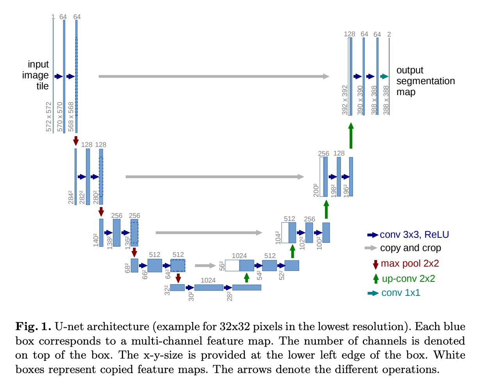

# Stable diffusion คืออะไร


 ถ้าอธิบายภาษาบ้าน ๆ ดูตามรูปเลย คือ เขียนข้อความ แล้วใช้โมเดล ของ Stable diffusion  หลัก ๆ สามตัวนี้ คือ CLIP, U-NET และ VAE
 จบ การอธิบาย แบบง่าย ๆ เข้าใจแค่นี้ เจนรูปได้แล้ว

---
แต่ถ้าใครอยากเข้าใจมากขึ้น (ปวดหัวมากกว่านี้) ลองตามอ่านต่อ เรื่อง U-Net <br>
ป. ลิง U-Net ในที่นี้ ไม่ใช่ U-NET (University National Education Test )  <br>

# U-Net คืออะไร <br>
U-Net เป็นโครงข่าย Network ที่มีโครงสร้างเป็นรูปตัว "U" พัฒนาโดย [Olaf Ronneberger et al. 2015](https://arxiv.org/abs/1505.04597) ที่ออกแบบมาเพื่อ Image Segmentation หรือ การประมวลผลภาพ และใช้กันอย่างแพร่หลายใน Deep Learning และ Computer Vision โดยเฉพาะในงาน Image-to-Image Translation, Medical Image Processing และ Generative Models <br>

💡 U-Net ถูกใช้ใน Stable Diffusion เพื่อ ลบสัญญาณรบกวน (denoising) และช่วยสร้างภาพที่แม่นยำจาก latent space <br>

 <br>
หน้าตาของ U-Net เป็นรูปตัว U  <br>

# 🖼️ **U-Net ใน Stable Diffusion: โครงสร้างและการทำงาน** <br>

## **📌 1. U-Net คืออะไร?** <br>
**U-Net** เป็นโครงข่ายประสาทเทียมแบบ **Encoder-Decoder** ที่มีโครงสร้างเป็นรูปตัว **"U"**   <br>
ใช้กันอย่างแพร่หลายใน **Image Segmentation, Image Processing และ AI Image Generation**   <br>

ใน **Stable Diffusion**, **U-Net** มีหน้าที่หลักคือ: <br>
- **ลดสัญญาณรบกวน (Denoising)** ใน **Latent Space** <br>
- **เข้าใจข้อมูลจาก Text Prompt** และ **ควบคุมการสร้างภาพ** <br>
- **ทำ Cross Attention กับข้อความ** เพื่อให้ภาพที่สร้างตรงกับคำสั่งมากขึ้น <br>

---

## **📌 2. โครงสร้างของ U-Net** <br>
U-Net แบ่งออกเป็น 3 ส่วนหลัก: <br>

| **Component**  | **รายละเอียด** |
|--------------|----------------|
| **🔻 Encoder (Downsampling Path)** | ลดขนาดภาพโดยใช้ **Convolution + ReLU** ดึง Feature สำคัญ |
| **⚡ Bottleneck (Middle Layer)** | ใช้ **Self-Attention + Cross-Attention** เพื่อเชื่อมโยงข้อมูลภาพกับข้อความ |
| **🔺 Decoder (Upsampling Path)** | ขยายภาพกลับโดยใช้ **Transposed Convolutions** และเติมรายละเอียด |

✅ **ใช้ Skip Connections เชื่อมข้อมูลจาก Encoder → Decoder เพื่อป้องกันการสูญเสียข้อมูล** <br>

---

## **📌 3. การทำงานของ U-Net ใน Stable Diffusion**
1️⃣ **รับข้อมูลจาก Latent Space** (ขนาด 4×64×64)  
2️⃣ **รับ Text Embedding จาก CLIP Text Encoder**  
3️⃣ **ใช้ Cross-Attention เชื่อมภาพกับข้อความ**  
4️⃣ **ใช้ Encoder ลดขนาดภาพ (64×64 → 8×8)**  
5️⃣ **ใช้ Bottleneck ทำ Self-Attention**  
6️⃣ **ใช้ Decoder ขยายภาพกลับ (8×8 → 64×64)**  
7️⃣ **Output เป็น Latent Space ที่ลด noise แล้ว**  
8️⃣ **ส่งไปที่ VAE Decoder เพื่อสร้างภาพ 512×512**

---

## **📌 4. ตัวอย่างโค้ด U-Net ใน Stable Diffusion**
```python
from diffusers import UNet2DConditionModel
import torch

# โหลดโมเดล U-Net
unet = UNet2DConditionModel.from_pretrained("CompVis/stable-diffusion-v1-4", subfolder="unet")
unet.to("cuda")

# สร้าง Latent Noise ขนาด 4×64×64
latent_noise = torch.randn((1, 4, 64, 64)).to("cuda")

# ใช้ U-Net ลบ noise ออกจาก Latent Space
with torch.no_grad():
    denoised_latent = unet(latent_noise).sample

print("Shape ของ Output:", denoised_latent.shape)  # (1, 4, 64, 64)
```
# References
1. U-Net: Convolutional Networks for Biomedical Image Segmentation https://arxiv.org/pdf/1505.04597
2. Denoising Diffusion Probabilistic Models https://arxiv.org/pdf/2006.11239
