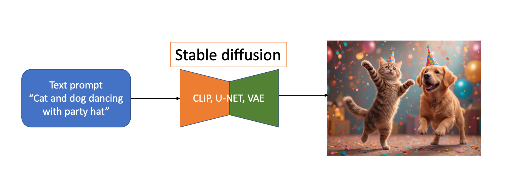
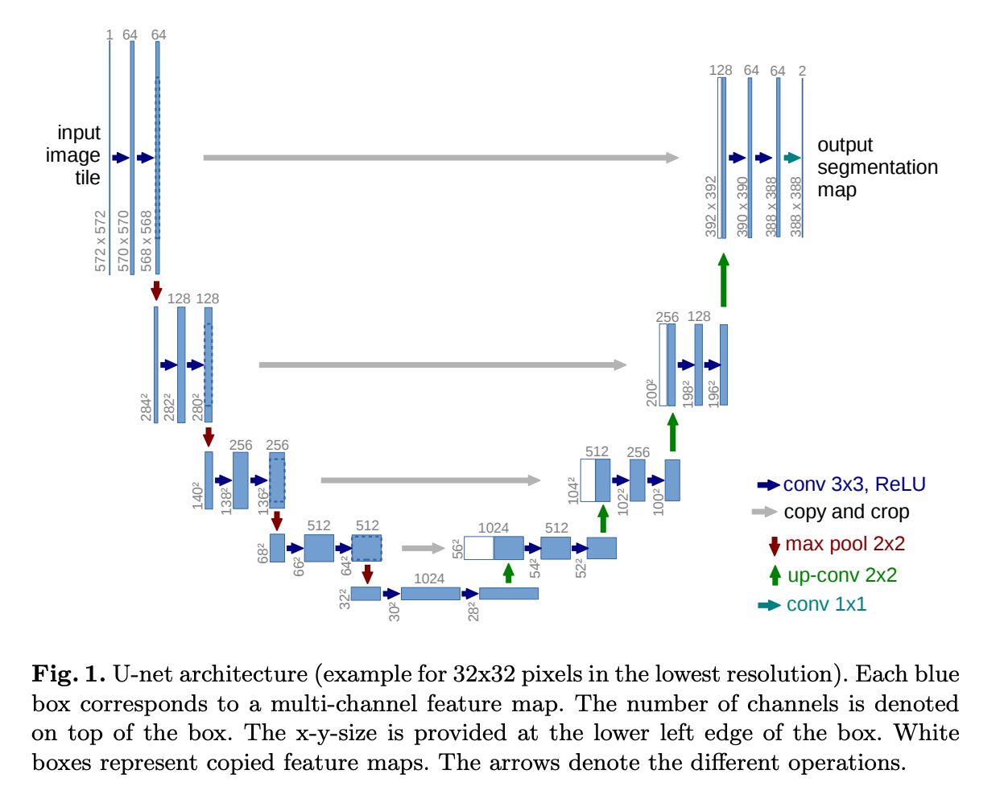

# Stable diffusion คืออะไร


 ถ้าอธิบายภาษาบ้าน ๆ ดูตามรูปเลย คือ เขียนข้อความ แล้วใช้โมเดล ของ Stable diffusion  หลัก ๆ สามตัวนี้ คือ CLIP, U-Net และ VAE
 เพื่อให้ได้ภาพจากข้อความที่เราเขียน ซึ่งจินตนาการล้วน ๆ เป็นสิ่งที่ไม่มีจริงในโลกนี้ก็ได้ .... จบ การอธิบาย แบบง่าย ๆ เข้าใจแค่นี้ เจนรูป(ย่อจาก Image Generative AI) ได้แล้ว

---
แต่ถ้าใครอยากเข้าใจมากขึ้น (ปวดหัวมากกว่านี้) ลองตามอ่านต่อ เรื่อง U-Net <br>
ป. ลิง U-Net ในที่นี้ ไม่ใช่ U-NET (University National Education Test )  <br>

# U-Net คืออะไร <br>
U-Net เป็นโครงข่าย Network ที่มีโครงสร้างเป็นรูปตัว "U" พัฒนาโดย [Olaf Ronneberger et al. 2015](https://arxiv.org/abs/1505.04597) ที่ออกแบบมาเพื่อ Image Segmentation หรือ การประมวลผลภาพ และใช้กันอย่างแพร่หลายใน Deep Learning และ Computer Vision โดยเฉพาะในงาน Image-to-Image Translation, Medical Image Processing และ Generative Models <br>

💡 U-Net ถูกใช้ใน Stable Diffusion เพื่อ ลบสัญญาณรบกวน (denoising) และช่วยสร้างภาพที่แม่นยำจาก latent space <br>

 <br>
หน้าตาของ U-Net เป็นรูปตัว U  <br>
**รูปที่ 1** ตัวอย่างโครงสร้างของ U-Net ในการเพิ่ม Noise และแปลงข้อมูลของ Latent space ที่ถูกลดขนาดลง เพื่อช่วยลดความจำ โดยข้อมูลถูกลดขนาดเล็กลงประมาณ 40 เท่า แล้วเพิ่ม Noise ให้ได้รูปกลับมา <br>

# 🖼️ **U-Net ใน Stable Diffusion: โครงสร้างและการทำงาน** <br>

## **📌 1. U-Net คืออะไร?** <br>
**U-Net** เป็นโครงข่ายประสาทเทียมแบบ **Encoder-Decoder** ที่มีโครงสร้างเป็นรูปตัว **"U"**   <br>
ใช้กันอย่างแพร่หลายใน **Image Segmentation, Image Processing และ AI Image Generation**   <br>

ใน **Stable Diffusion**, **U-Net** มีหน้าที่หลักคือ: <br>
- **ลดสัญญาณรบกวน (Denoising)** ใน **Latent Space** <br>
- **เข้าใจข้อมูลจาก Text Prompt** และ **ควบคุมการสร้างภาพ** <br>
- **ทำ Cross Attention กับข้อความ** เพื่อให้ภาพที่สร้างตรงกับคำสั่ง Prompt หรือ Input อื่น ๆ มากขึ้น <br>

---

## **📌 2. โครงสร้างของ U-Net** <br>
U-Net แบ่งออกเป็น 3 ส่วนหลัก: <br>

| **Component**  | **รายละเอียด** |
|--------------|----------------|
| **🔻 Encoder (Downsampling Path)** | ลดขนาดภาพโดยใช้ **Convolution + ReLU** ดึง Feature สำคัญ |
| **⚡ Bottleneck (Middle Layer)** | ใช้ **Self-Attention + Cross-Attention** เพื่อเชื่อมโยงข้อมูลภาพกับข้อความ |
| **🔺 Decoder (Upsampling Path)** | ขยายภาพกลับโดยใช้ **Transposed Convolutions** และเติมรายละเอียด |

✅ **ใช้ Skip Connections เชื่อมข้อมูลจาก Encoder → Decoder เพื่อป้องกันการสูญเสียข้อมูล** <br>

---

## **📌 3. การทำงานของ U-Net ใน Stable Diffusion**
1️⃣ **รับข้อมูลจาก Latent Space** (ขนาด 4×64×64) ถูกแปลงมาจาก Transformer (512 x 512 x 3 จากข้อ 5.1)  <br>
2️⃣ **รับ Text Embedding จาก CLIP Text Encoder**  <br>
3️⃣ **ใช้ Cross-Attention เชื่อมภาพกับข้อความ**  <br>
4️⃣ **ใช้ Encoder ลดขนาดภาพ (64×64 → 8×8)** ลดขนาด เพื่อทำให้การคำควณรวดเร็วขึ้น <br> 
5️⃣ **ใช้ Bottleneck ทำ Self-Attention** ส่วนล่างสุดของตัว U <br> 
6️⃣ **ใช้ Decoder ขยายภาพกลับ (8×8 → 64×64)** สร้างภาพย้อนกลับ หรือ U ขาขึ้น  <br>
7️⃣ **Output เป็น Latent Space ที่ลด noise แล้ว** ใช้ Loop หลาย step ค่อยๆ สร้างภาพ <br>
8️⃣ **ส่งไปที่ VAE Decoder เพื่อสร้างภาพ 512×512** แปลงจาก Laten space ที่เป็น vector มาเป็น Pixel space RGB <br>

---
### ขั้นตอนหลักของ Encoder มี 3 กระบวนการ: ลดขนาด Latent space หรือ U ขาลงด้าน ซ้ายมือ <br>
1️⃣ Convolution (ดึง Feature สำคัญ) <br>
2️⃣ ReLU Activation (เพิ่มความไม่เป็นเชิงเส้นของโมเดล)  (Rectified Linear Unit) เป็นฟังก์ชัน Activation ที่ทำให้ค่าลบเป็นศูนย์ และ ช่วยให้โมเดลสามารถเรียนรู้ Feature ที่ซับซ้อนได้ดีขึ้น <br>
```
📊 Convolution Output:
[[1,  2, -1],
 [0,  1,  2],
 [1, -1,  3]]

🚀 หลังจากใช้ ReLU:
[[1, 2, 0],
 [0, 1, 2],
 [1, 0, 3]]
```


3️⃣ Max Pooling ช่วยลดขนาดของภาพ แต่ยังคง Feature ที่สำคัญ และ Max Pooling ใช้เลือกค่าที่มากที่สุดจากแต่ละโซนของภาพ  <br>
```
📊 Input Feature Map (4×4):
[[2, 3, 1, 0],
 [5, 7, 6, 1],
 [4, 6, 8, 5],
 [9, 2, 3, 6]]

🚀 Max Pooling 2×2 (Stride=2):
[[7, 6],
 [9, 8]]
```
step นี้ ทำให้ ข้อมูลลดลง เพื่อความเร็วในการคำนวณ แต่ยังคงไว้ซึ่งข้อมูลที่สำคัญ ๆ เท่านั้น
---
## 📌 Diffusion Process (Denoising) คืออะไร? ทำงานอย่างไร? 
📜 1. Diffusion Process คืออะไร? <br>
Diffusion Process เป็นกระบวนการที่ใช้ใน Stable Diffusion, DALL·E 2, Imagen <br>
✅ เริ่มต้นจากภาพสุ่มที่มี Noise (Pure Gaussian Noise) <br>
✅ ค่อยๆ ลบ Noise ออกจากภาพ โดยใช้ U-Net และ Cross-Attention <br>
✅ ช่วยให้โมเดลสร้างภาพที่มีความคมชัดและตรงกับข้อความมากขึ้น <br>

💡 ใน Stable Diffusion → U-Net ใช้เรียนรู้ว่าควรลบ Noise แบบไหนเพื่อให้ได้ภาพที่ตรงกับ Text Prompt <br>

## 📜 2. กระบวนการของ Diffusion Process <br>
🔹 กระบวนการแบ่งออกเป็น 2 ส่วนหลัก <br>
1️⃣ Forward Diffusion (เพิ่ม Noise เข้าไป) <br>
2️⃣ Reverse Diffusion (ลบ Noise ออกทีละขั้นตอน - Denoising) <br>

 <br>
REAL-WORLD DENOISING VIA DIFFUSION MODEL http://arxiv.org/pdf/2403.18103 <br>
**รูปที่ 2** ตัวอย่างการเพิ่ม Noise และ ลบ Noise เพื่อที่จะสร้างรูปใหม่

🔹 1️⃣ Forward Diffusion (เพิ่ม Noise เข้าไป) <br>
📌 ในขั้นตอนนี้ โมเดลจะฝึกให้ AI เรียนรู้ว่าถ้าเพิ่ม Noise ทีละนิด รูปภาพจะเปลี่ยนไปยังไง <br>

เริ่มต้นจากภาพจริง (x₀) <br>
เพิ่ม Noise ไปทีละเล็กน้อยจนกลายเป็น Gaussian Noise (xₜ) <br>
ใช้ [Markov Chain Process](https://www.wikiwand.com/en/articles/Markov_chain) ในการเพิ่ม Noise (Markov chain เป็นหลักการคำนวณความน่าจะเป็น เพื่อคาดการล่วงหน้า) <br>
✅ Forward Diffusion ใช้ Gaussian Noise Formula ดังรูปตัวอย่าง <br>

 <br>
ตัวอย่างโมเดลในการเพิ่ม Noise <br>

🔹 2️⃣ Reverse Diffusion (ลบ Noise ออก - Denoising) <br>
📌 ในขั้นตอนนี้ โมเดลจะเรียนรู้ว่าต้องลบ Noise ยังไงให้ได้ภาพเดิมกลับมา <br>
✅ ใช้โมเดล U-Net + Cross Attention เพื่อลด Noise ทีละ Step <br>
✅ เปลี่ยนภาพที่เต็มไปด้วย Noise ให้กลับมาเป็นภาพที่มีรายละเอียดชัดเจน <br>

📌 Reverse Diffusion ใช้ Gaussian Distribution Formula<br>
 <br>
ตัวอย่างโมเดลในการ ลบ Noise <br>

## 📜  สรุป <br>
Diffusion Process คือกระบวนการลบ Noise ออกจากภาพ <br>
ใช้ Gaussian Noise ในการเพิ่มและลบ Noise ออก <br>
ใช้ การคำนวณ ทางสถิติ เวคเตอร์ ของU-Net เป็นตัวลบ Noise ทีละ Step <br>
ต้องทำซ้ำหลายรอบ (50-1000 Steps) เพื่อให้ได้ภาพที่สมจริง <br>
เป็นกระบวนการหลักของ Stable Diffusion, DALL·E 2 และ Generative AI ทั่วไป <br>
✅ Diffusion Process เป็นหัวใจของ AI Generative Models! 🚀 <br>
✅ สุดท้ายใช้ VAE Decoder แปลง Latent Space กลับเป็นภาพจริง (Pixel Space) ตามอ่าน ตอนต่อไปจ้า [ข้อ 5.3 Basic VAE](https://github.com/gordon123/lean2ComfyUI/blob/main/(Thai)%20%235.3%20Basic%20VAE.md)<br>

# 📜 1. Sampler คืออะไร?
📌 Sampler คืออัลกอริธึมที่ควบคุมวิธีที่ U-Net จะลบ Noise ออกจากภาพ <br>
📌 เป็นปัจจัยสำคัญที่ส่งผลต่อคุณภาพของภาพ, ความเร็วในการประมวลผล และความเสถียรของผลลัพธ์ <br>

🔹 Sampler ส่งผลต่อ <br>
✅ สไตล์ของภาพ → ภาพคมชัด, นุ่มนวล, เบลอ หรือมีรายละเอียดสูง <br>
✅ ความเร็วของการเจนภาพ → ใช้จำนวน Steps น้อยลงหรือมากขึ้น <br>
✅ เสถียรภาพของภาพ → ภาพมีความสมจริงและตรงกับ Prompt มากขึ้น <br>

💡 แต่ละ Sampler มีจุดเด่นที่แตกต่างกัน และเหมาะกับการใช้งานที่แตกต่างกัน <br>
📌 ตัวอย่าง Sampler ที่นิยมใช้ <br>
✅ Euler / Euler Ancestral → เร็ว, คมชัด, ใช้ Steps น้อย <br>
✅ DPM-Solver++ / Karras → คุณภาพสูง, สีสมจริง, ใช้ Steps น้อย <br>
✅ DDIM → ภาพนุ่มนวล, ทำงานเร็ว, ลด Steps ได้ <br>
✅ LMS / PNDM → สมดุลระหว่างคุณภาพกับความเร็ว <br>
✅ PLMS → ภาพที่มีสไตล์เฉพาะตัว <br>

# 📌  Sampler ทั้งหมดใน ComfyUI Update Feb 2025

| **Sampler** | **หมวดหมู่** | **รายละเอียด** | **เหมาะกับงาน** | **Reference (ถ้ามี)** |
|------------|------------|----------------|----------------|----------------|
| **Euler** | ODE-Based | เร็ว คมชัด ใช้ Steps น้อย | Text-to-Image, Image-to-Image | [Karras et al., 2022](https://arxiv.org/abs/2206.00364) |
| **Euler Ancestral** | ODE-Based | ให้ Contrast สูง รายละเอียดดี | Text-to-Image, Upscale | [Karras et al., 2022](https://arxiv.org/abs/2206.00364) |
| **Euler Ancestral Dancing** | ODE-Based | ปรับปรุง Euler Ancestral ให้ได้ผลลัพธ์ที่มีการเคลื่อนไหวดีขึ้น | Text-to-Video | ❌ ไม่มีข้อมูล |
| **Heun** | ODE-Based | สมดุลระหว่างคุณภาพและความเร็ว | Image-to-Image | [Rackauckas et al., 2020](https://arxiv.org/abs/2001.04385) |
| **HeunPP2** | ODE-Based | ปรับปรุง Heun ให้มีประสิทธิภาพมากขึ้น | Text-to-Image | ❌ ไม่มีข้อมูล |
| **LMS** | SDE-Based | ผลลัพธ์สมจริง คมชัด ใช้ Steps มากขึ้น | Text-to-Image, Text-to-3D | [Karras et al., 2022](https://arxiv.org/abs/2206.00364) |
| **PNDM** | SDE-Based | ออกแบบมาให้ทำงานใน Latent Space ได้ดี | Text-to-Image | [Liu et al., 2022](https://arxiv.org/abs/2202.09778) |
| **DPM_2** | SDE-Based | สมดุลระหว่างคุณภาพและการลด Noise | Image-to-Image, Text-to-3D | [Lu et al., 2022](https://arxiv.org/abs/2206.00927) |
| **DPM_2_Ancestral** | SDE-Based | ปรับปรุงจาก DPM_2 ให้ได้ผลลัพธ์ที่ดีขึ้น | Text-to-Image | ❌ ไม่มีข้อมูล |
| **DPM-Fast** | SDE-Based | เน้นความเร็ว ใช้ Steps น้อย | Text-to-Image, Video | ❌ ไม่มีข้อมูล |
| **DPM-Adaptive** | SDE-Based | ปรับค่าการลด Noise ตามโครงสร้างของภาพ | Image-to-Image | ❌ ไม่มีข้อมูล |
| **DPM++ 2M** | SDE-Based | คุณภาพดี ใช้ Steps น้อย | Text-to-Image, Text-to-Video | [Lu et al., 2022](https://arxiv.org/abs/2206.00927) |
| **DPM++ 2M SDE** | SDE-Based | ปรับให้รองรับการทำงานแบบ Stochastic | Text-to-Image | [Lu et al., 2022](https://arxiv.org/abs/2206.00927) |
| **DPM++ 2S Ancestral** | SDE-Based | เพิ่มความแม่นยำของภาพในช่วงสุดท้าย | Text-to-Image, Text-to-3D | ❌ ไม่มีข้อมูล |
| **DPM++ 3M SDE** | SDE-Based | รองรับการทำงานแบบ 3rd Order SDE | Text-to-Image, Image-to-Video | ❌ ไม่มีข้อมูล |
| **DPM++ 3M SDE GPU** | SDE-Based | ปรับให้รองรับ GPU ให้เร็วขึ้น | Text-to-Image | ❌ ไม่มีข้อมูล |
| **DPM++ 3M SDE Dynamic ETA** | SDE-Based | ปรับค่าการลด Noise ให้เหมาะสมอัตโนมัติ | Text-to-Video, Text-to-3D | ❌ ไม่มีข้อมูล |
| **DDIM** | Implicit Model | ภาพนุ่มนวล สีสมจริง ใช้ Steps น้อย | Image-to-Image, Upscale | [Song et al., 2020](https://arxiv.org/abs/2010.02502) |
| **UNI-PC** | Implicit Model | ใช้ Predictor-Corrector Method เพื่อให้ภาพแม่นยำขึ้น | Text-to-Image, Text-to-3D | [Zheng et al., 2023](https://arxiv.org/abs/2302.04867) |
| **UNI-PC BH2** | Implicit Model | ปรับ UNI-PC ให้มีเสถียรภาพดีขึ้น | Text-to-Image, Text-to-Video | ❌ ไม่มีข้อมูล |
| **Supreme** | Implicit Model | อัลกอริธึมใหม่ที่ยังไม่มีข้อมูลมากนัก | Unknown | ❌ ไม่มีข้อมูล |
| **TTM** | Implicit Model | Sampler ใหม่ที่อาจใช้เทคนิคการเพิ่มความแม่นยำ | Unknown | ❌ ไม่มีข้อมูล |
| **LCM** | Momentum-Based | Latent Consistency Model, ใช้ลดการสูญเสียรายละเอียด | Text-to-Image, Upscale | [Bansal et al., 2023](https://arxiv.org/abs/2305.08891) |
| **LCM Custom Noise** | Momentum-Based | ปรับ LCM ให้สามารถใช้ Noise ที่กำหนดเองได้ | Text-to-Image | ❌ ไม่มีข้อมูล |
| **DPM++ Dual SDE Momentumized** | Momentum-Based | ใช้เทคนิค Momentum เพื่อลดการสั่นของภาพ | Text-to-Video, Image-to-Video | ❌ ไม่มีข้อมูล |
| **CLyB-4M SDE Momentumized** | Momentum-Based | ปรับปรุง DPM-SDE ให้ใช้ Momentum | Text-to-Video | ❌ ไม่มีข้อมูล |
| **Res-Momentumized** | Momentum-Based | ใช้ Momentum เพื่อให้ภาพคมชัดและมีรายละเอียดสูง | Text-to-Image, Upscale | ❌ ไม่มีข้อมูล |

📜 1. ODE-Based (Ordinary Differential Equations)  <br>
📌 ODE-Based Sampler ใช้สมการเชิงอนุพันธ์สามัญ (Ordinary Differential Equations - ODEs) เพื่อกำหนดการลด Noise ในแต่ละขั้นตอน  <br>
📌 ทำงานโดยการแก้สมการเชิงอนุพันธ์ที่อธิบายกระบวนการย้อนกลับของ Diffusion Model  <br>
📌 นิยมใช้ใน Euler, Heun และ Karras Sampler  <br>

🔹 หลักการทำงาน  <br>
> ใช้ Euler Method หรือ Runge-Kutta Method ในการคำนวณการเปลี่ยนแปลงของ Noise  <br>
> แก้ ODE แบบเชิงตัวเลข เพื่อประมาณค่าภาพที่ไม่มี Noise <br>
> ไม่มีความสุ่ม → สามารถให้ผลลัพธ์ที่มีความคงที่สูง <br>
🔹 สมการพื้นฐานของ ODE ใน Diffusion Models <br>

 <br>
🔹 ตัวอย่าง ODE-Based Sampler <br>
 <br>

✅ เหมาะสำหรับ: <br>
> Text-to-Image ที่ต้องการความเร็วและคมชัด <br>
> Image-to-Image ที่ต้องการเก็บรายละเอียดของภาพเดิม <br>

📜 2. SDE-Based (Stochastic Differential Equations) <br>
📌 SDE-Based Sampler ใช้สมการเชิงอนุพันธ์แบบสุ่ม (Stochastic Differential Equations - SDEs) <br>
📌 แตกต่างจาก ODE ตรงที่มีการเพิ่ม Gaussian Noise เข้าไปในแต่ละ Step <br>
📌 นิยมใช้ใน LMS, DPM-Solver, และ PNDM <br>

🔹 หลักการทำงาน <br>
ใช้ SDEs ในการสร้างภาพโดยลด Noise ทีละนิด <br>
มีองค์ประกอบของ Gaussian Noise ที่ถูกเพิ่มเข้ามาแบบสุ่ม ทำให้ภาพมีความหลากหลายมากขึ้น <br>
ใช้ Euler-Maruyama หรือ Predictor-Corrector Method ในการคำนวณ <br>
🔹 สมการพื้นฐานของ SDE ใน Diffusion Models <br>

 <br>
🔹 ตัวอย่าง SDE-Based Sampler <br>
 <br>

✅ เหมาะสำหรับ: <br>

Text-to-3D ที่ต้องการรายละเอียดสูง <br>
Text-to-Video ที่ต้องการความสมูทระหว่างเฟรม <br>

📜 3. Implicit Models (Non-Markovian / Latent Space Optimization) <br>
📌 Implicit Models ใช้ Latent Space Optimization และไม่ใช้ Markov Process <br>
📌 นิยมใช้ใน DDIM, UNI-PC และ PLMS <br>

🔹 หลักการทำงาน <br>
ไม่ใช้การลด Noise แบบเป็นลำดับที่ต้องอาศัยข้อมูลก่อนหน้า (Non-Markovian) <br>
ใช้ Optimized Latent Space เพื่อให้ได้ภาพที่มีคุณภาพสูงขึ้นและใช้ Steps น้อยลง <br>
มักใช้กับ Implicit Diffusion Models ที่ไม่ต้องพึ่งพาการรันทั้งหมดของ Diffusion Process <br>
🔹 สมการพื้นฐานของ Implicit Models <br>

 <br>
🔹 ตัวอย่าง Implicit Models <br>
 <br>


✅ เหมาะสำหรับ: <br>

Image-to-Image ที่ต้องการเก็บรายละเอียดเดิม <br>
Upscaling ที่ต้องการเพิ่มความละเอียดภาพ <br>

📜 4. Momentum-Based / Adaptive Sampler <br>
📌 Momentum-Based Sampler ใช้แนวคิดของ Optimization และ Momentum เพื่อช่วยลด Noise อย่างมีประสิทธิภาพ <br>
📌 นิยมใช้ใน DPM++ Momentumized และ LCM (Latent Consistency Model) <br>

🔹 หลักการทำงาน <br>
ใช้เทคนิค Momentum Optimization เพื่อให้ภาพที่ได้มีความสมูทมากขึ้น <br>
ลดความจำเป็นในการใช้ Steps เยอะๆ โดยอาศัยค่า Gradient Momentum <br>
ใช้ Adaptive Learning Rate เพื่อลด Error ในการลบ Noise <br>
🔹 สมการพื้นฐานของ Momentum-Based Sampler <br>

 <br>
🔹 ตัวอย่าง Momentum-Based Sampler <br>
 <br>

✅ เหมาะสำหรับ: <br>

Text-to-Image ที่ต้องการรายละเอียดสูง <br>
Upscaling ที่ต้องการเพิ่มความละเอียด <br>

---
## 📜 3. เปรียบเทียบ Sampler ต่างๆ

| **Sampler** | **ลักษณะของภาพที่ได้** | **ความเร็ว** | **ความคมชัด** | **ความสมจริง** |
|------------|----------------|------------|------------|-------------|
| **Euler** | ภาพคมชัด, เก็บรายละเอียดได้ดี | 🚀 เร็วมาก | ⭐⭐⭐⭐⭐ | ⭐⭐⭐⭐☆ |
| **Euler Ancestral** | ภาพมี Contrast สูง, รายละเอียดชัด | 🚀 เร็ว | ⭐⭐⭐⭐⭐ | ⭐⭐⭐⭐⭐ |
| **DDIM** | ภาพนุ่มนวล, สีสมจริง | 🚀 เร็วมาก | ⭐⭐⭐⭐☆ | ⭐⭐⭐⭐⭐ |
| **DPM-Solver++** | สมดุลระหว่างความเร็วและคุณภาพ | 🚀 เร็วมาก | ⭐⭐⭐⭐⭐ | ⭐⭐⭐⭐⭐ |
| **Karras** | ภาพมีรายละเอียดสูง, สีสดใส | 🏎️ ปานกลาง | ⭐⭐⭐⭐⭐ | ⭐⭐⭐⭐⭐ |
| **PLMS** | ภาพมีลักษณะเฉพาะตัว, คมชัด | 🏎️ ปานกลาง | ⭐⭐⭐⭐⭐ | ⭐⭐⭐⭐☆ |
| **LMS** | ภาพดูสมจริง, นุ่มนวล | 🏎️ ปานกลาง | ⭐⭐⭐⭐☆ | ⭐⭐⭐⭐⭐ |

✅ **ถ้าอยากให้ภาพออกมาคมชัด → ใช้ Euler หรือ DPM-Solver++**   <br>
✅ **ถ้าอยากให้ภาพออกมานุ่มนวล → ใช้ DDIM หรือ LMS**   <br>

---

## 📜 7. คำแนะนำในการเลือก Sampler ตามการใช้งาน <br>

| **การใช้งาน** | **Sampler ที่แนะนำ** | **เหตุผล** |
|--------------|-----------------|------------------|
| **Text-to-Image** | Euler, DPM-Solver++, DDIM | คุณภาพสูง, ทำงานเร็ว |
| **Image-to-Image** | Euler Ancestral, DDIM | เก็บรายละเอียดของภาพเดิมไว้ได้ดี |
| **Text-to-Video** | DPM-Solver++, Karras | ควบคุมการเปลี่ยนแปลงของเฟรมได้ดี |
| **Text-to-3D** | LMS, PNDM, UNI-PC | ควบคุมโครงสร้างของภาพได้แม่นยำ |
| **Image-to-Video** | DPM-Solver++, Euler | ช่วยให้ภาพเคลื่อนไหวต่อเนื่อง |
| **Upscaling (Latent Upscaler)** | DDIM, PLMS | เพิ่มรายละเอียดให้คมชัดขึ้น |

✅ **เลือก Sampler ที่เหมาะกับงานจะช่วยให้ได้ผลลัพธ์ที่ดีที่สุด!** 🚀 <br>
---
### 📜 Scheduler คืออะไร?
📌 Scheduler ควบคุมการลบ Noise ในแต่ละ Diffusion Step ของ Stable Diffusion  <br>
📌 ทำงานร่วมกับ Sampler เพื่อให้ U-Net สามารถลด Noise ได้อย่างมีประสิทธิภาพ <br>
📌 Scheduler มีผลต่อความเร็วและคุณภาพของภาพที่สร้างขึ้น <br>

# 📜 รายชื่อ Scheduler 
| **Scheduler** | **คำอธิบาย** | **ข้อดี** | **ข้อเสีย** | **เหมาะกับงาน** | **Reference** |
|--------------|-----------------|------------|-------------|---------------|----------------|
| **Normal** | ค่าเริ่มต้นของ Stable Diffusion ที่ใช้ค่าการลบ Noise มาตรฐาน | เสถียร, ใช้งานง่าย | คุณภาพปานกลาง | Text-to-Image, Image-to-Image | ❌ ไม่มีข้อมูล |
| **Karras** | ใช้อัลกอริธึมของ Karras ในการลด Noise ทำให้ภาพคมชัดและสีสดใสขึ้น | ให้ภาพคุณภาพสูง, สีคมชัด | ใช้พลังงานเพิ่มขึ้น | Upscaling, Text-to-3D | [Karras et al., 2022](https://arxiv.org/abs/2206.00364) |
| **Exponential** | ใช้ฟังก์ชันลด Noise แบบ Exponential Decay เพื่อลดจำนวน Steps | ใช้ Steps น้อย, ทำงานเร็ว | อาจมี Noise เหลือในช่วงแรก | Text-to-Video, Image-to-Image | ❌ ไม่มีข้อมูล |
| **SGM Uniform** | ใช้ Score-Based Generative Models (SGM) ในการกำหนดค่าการลบ Noise | แสงและเงาสมจริงขึ้น | ใช้พลังงานสูงขึ้น | Text-to-Image, Text-to-3D | [Song et al., 2021](https://arxiv.org/abs/2101.09258) |
| **Simple** | ลดความซับซ้อนของ Normal Scheduler ทำให้การคำนวณเร็วขึ้น | ทำงานเร็ว, ใช้พลังงานน้อย | คุณภาพภาพอาจต่ำลง | การทดสอบ, Upscaling | ❌ ไม่มีข้อมูล |
| **DDIM Uniform** | ปรับแต่งค่า Scheduler ให้เหมาะกับ DDIM (Denoising Diffusion Implicit Models) | ใช้ Steps น้อยลง, ภาพดูนุ่มนวล | อาจทำให้ภาพเบลอเกินไป | Image-to-Image, Text-to-Image | [Song et al., 2020](https://arxiv.org/abs/2010.02502) |
| **Beta** | ใช้ค่าของ Beta ที่กำหนดล่วงหน้าเพื่อคำนวณการลบ Noise | ควบคุมง่าย, เสถียร | คุณภาพอาจต่ำกว่าตัวอื่น | Text-to-Image, Text-to-Video | ❌ ไม่มีข้อมูล |
| **Linear Quadratic** | ใช้การผสมระหว่าง Linear และ Quadratic Scaling เพื่อลด Noise อย่างมีประสิทธิภาพ | ควบคุมคุณภาพภาพได้ดี | ต้องปรับค่าเยอะ | Upscaling, Text-to-3D | ❌ ไม่มีข้อมูล |
| **AYS** | ยังไม่มีข้อมูลมากนัก แต่คาดว่าเป็นการกำหนดค่าการลบ Noise ที่แตกต่างจากตัวอื่น | ต้องทดสอบเพิ่มเติม | ไม่มีข้อมูลที่ชัดเจน | ❓ ไม่ทราบแน่ชัด | ❌ ไม่มีข้อมูล |
| **AYS+** | อัปเกรดจาก AYS ให้มีการทำงานที่แม่นยำขึ้น | ต้องทดสอบเพิ่มเติม | ไม่มีข้อมูลที่ชัดเจน | ❓ ไม่ทราบแน่ชัด | ❌ ไม่มีข้อมูล |
| **AYS_30** | ปรับแต่งให้เหมาะกับการใช้ 30 Steps | เหมาะกับการใช้จำนวน Steps ต่ำ | ไม่มีข้อมูลที่ชัดเจน | ❓ ไม่ทราบแน่ชัด | ❌ ไม่มีข้อมูล |
| **AYS_30+** | ปรับปรุงจาก AYS_30 ให้มีคุณภาพสูงขึ้น | เหมาะกับการใช้ Steps ต่ำ | ไม่มีข้อมูลที่ชัดเจน | ❓ ไม่ทราบแน่ชัด | ❌ ไม่มีข้อมูล |
| **GITS** | ยังไม่มีข้อมูลแน่ชัด แต่คาดว่าเป็นการปรับปรุงการลด Noise ให้เร็วขึ้น | อาจช่วยให้ภาพมีคุณภาพดีขึ้น | ไม่มีข้อมูลที่ชัดเจน | ❓ ไม่ทราบแน่ชัด | ❌ ไม่มีข้อมูล |

---

### 📜 วิธีเลือก Scheduler ตามการใช้งาน
✅ ต้องการภาพคุณภาพสูง: ใช้ Karras, SGM Uniform, Linear Quadratic  <br>
✅ ต้องการภาพเร็วขึ้น: ใช้ Exponential, Simple, DDIM Uniform  <br>
✅ ต้องการ Upscaling หรือ Text-to-3D: ใช้ Karras, Linear Quadratic  <br>
✅ ต้องการใช้ Steps น้อย: ใช้ Exponential, DDIM Uniform, AYS_30  <br>
📜 สรุป  <br>
🔹 Scheduler เป็นตัวควบคุมว่าการลบ Noise จะเกิดขึ้นอย่างไรในแต่ละ Step  <br>
🔹 Scheduler ที่ดีสามารถลดจำนวน Steps และปรับคุณภาพของภาพได้  <br>
🔹 ควรเลือก Scheduler ให้เหมาะกับงาน เช่น Text-to-Image, Text-to-Video, Text-to-3D  <br>

✅ Scheduler มีผลอย่างมากต่อคุณภาพของภาพที่สร้างจาก Stable Diffusion! 🚀  <br>
---
# References <br>
1. U-Net: Convolutional Networks for Biomedical Image Segmentation https://arxiv.org/pdf/1505.04597 
2. Denoising Diffusion Probabilistic Models https://arxiv.org/pdf/2006.11239
