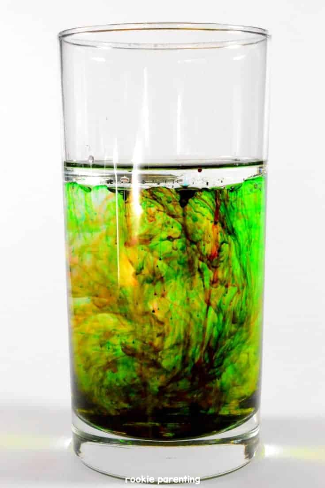
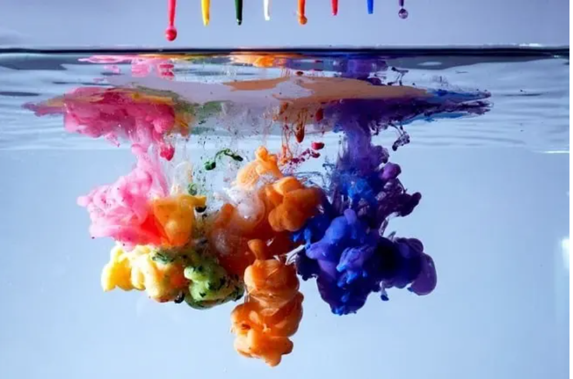

สารบัญ [hide]
Stable Diffusion คืออะไร?

ภาพสามารถเป็นภาพที่เหมือนจริงเหมือนภาพที่ถ่ายด้วยกล้อง หรือในรูปแบบศิลปะราวกับว่าสร้างโดยศิลปินมืออาชีพ
ส่วนที่ดีที่สุดคือมันฟรี – คุณสามารถเรียกใช้งานได้บนพีซีของคุณ

Stable Diffusion AI เอาไว้ใช้อะไร?
Stable Diffusion AI ฟรีไหม?
Stable Diffusion online
https://huggingface.co/spaces/darkstorm2150/Stable-Diffusion-Protogen-x3.4-webui
ทำอะไรได้บ้าง
1. เปลี่ยนหนังสือ เป็นรูปภาพจากจิตนาการ
2. สร้างรูปจากรูปเก่า
3. แต่เติม รูป
4. สร้าง Video จาก Text

How do you use Stable Diffusion AI?
Online generator
Advanced GUI
How to build a good prompt?
Rules of thumb for building good prompts
Be detailed and specific
Use powerful keywords
What are those parameters, and should I change them?
How many images should I generate?
Common ways to fix defects in images
Face Restoration
Fixing small artifacts with inpainting
What are custom models?
Which model should I use?
How to train a new model?
Negative prompts
How to make large prints with Stable Diffusion?
How to control image composition?
Image-to-image
ControlNet
Regional prompting
Depth-to-image
Generating specific subjects
Realistic people
Animals
What is unstable diffusion?
Next Step